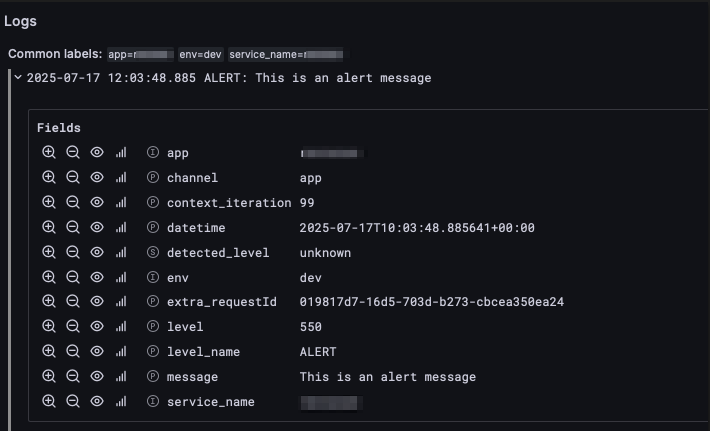

# Loki handler for Monolog

Loki handler for Monolog, providing a formatter that serializes records into the JSON format expected by Grafana Loki.

[](https://packagist.org/packages/tomas-kulhanek/monolog-loki)  
[](LICENSE)

## Table of Contents

- [Installation](#installation)
- [Usage](#usage)
- [Contributing](#contributing)
- [License](#license)

## Installation

Require the package via Composer:

```bash
composer require tomas-kulhanek/monolog-loki
```

## Usage

Below is a minimal example showing how to send logs to a Loki server:

```php
use Monolog\Level;
use Monolog\Logger;
use TomasKulhanek\Monolog\Loki\LokiHandler;

$handler = new LokiHandler(
    'http://your-loki-host:3100/loki/api/v1/push',
    'username',
    'password',
    ['app'=>'My application', 'env'=>'production'],
    Level::Debug
);

$logger = new Logger('loki');
$logger->pushHandler($handler);

$logger->info('User signed in', ['user_id' => 123]);
```


## Contributing

Contributions are very welcome! Please:

1. Fork the repository.
2. Create a feature branch (`git checkout -b feature/YourFeature`).
3. Make your changes, ensuring all tests pass and coding standards are met.
4. Submit a pull request.

## License

This project is licensed under the MIT License. See the [LICENSE](LICENSE) file for details.
